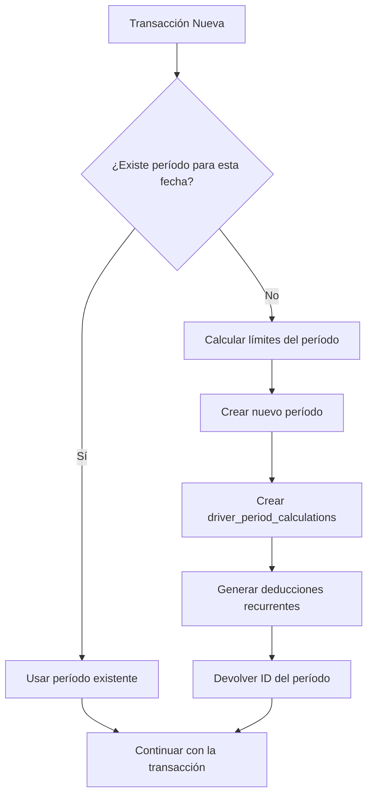

# Sistema de Períodos de Pago Bajo Demanda - v3.0 SIMPLIFICADO

## 🎯 NUEVO SISTEMA SIMPLIFICADO (v3.0)

**CAMBIO ARQUITECTÓNICO IMPORTANTE**: Eliminamos `company_payment_periods` y trabajamos solo con `user_payment_periods` individuales.

## 📋 Filosofía del Sistema

**PRINCIPIO FUNDAMENTAL**: Los períodos de pago se crean INDIVIDUALMENTE para cada usuario cuando ese usuario específico lo necesita.

### ❌ Lo que NO queremos (ANTIGUO SISTEMA):
- ~~Generar períodos de empresa que luego crean períodos para TODOS los usuarios~~
- ~~Crear períodos para usuarios que no tienen transacciones~~
- ~~Tabla `company_payment_periods` con lógica compleja~~
- ~~Generación masiva de períodos~~

### ✅ Lo que SÍ queremos (NUEVO SISTEMA v3.0):
- **Crear períodos SOLO para el usuario que realiza la transacción**
- **Un usuario, un período, una necesidad específica**
- **Sin períodos de empresa** - cada usuario gestiona sus propios períodos
- **Sistema mucho más simple y eficiente**

## 🎯 Casos de Uso - Cuándo se Crean Períodos

Los períodos se crean automáticamente cuando:

1. **Nueva Carga**: Al crear una carga con fecha de entrega/pickup
2. **Gasto de Combustible**: Al agregar transacciones de combustible
3. **Deducciones**: Al crear expense_instances o deducciones recurrentes
4. **Otros Ingresos**: Al agregar other_income para un conductor

## 🛠️ Componentes del Sistema

### 1. Función SQL Principal: `create_payment_period_if_needed`

```sql
SELECT create_payment_period_if_needed(
  target_company_id := 'company-uuid',
  target_date := '2025-01-15',
  created_by_user_id := 'user-uuid' -- opcional
);
```

**¿Qué hace?**
1. Busca si ya existe un período para esa fecha
2. Si existe, lo devuelve
3. Si no existe, calcula los límites del período según la frecuencia de la empresa
4. Crea el nuevo período
5. Genera automáticamente los `driver_period_calculations` para todos los conductores activos
6. Ejecuta las deducciones recurrentes
7. Devuelve el ID del período

### 2. Hook de JavaScript: `usePaymentPeriodGenerator`

```typescript
const { ensurePaymentPeriodExists } = usePaymentPeriodGenerator();

const periodId = await ensurePaymentPeriodExists({
  companyId: 'company-uuid',
  userId: 'user-uuid',
  targetDate: '2025-01-15'
});
```

### 3. Función Auxiliar: `ensure_payment_period_exists`

Wrapper simplificado para usar en triggers y otros contextos donde solo necesitas el ID del período.

## 📅 Lógica de Cálculo de Períodos

### Semanal (weekly)
- **Período**: Lunes a Domingo
- **Cálculo**: Encuentra el lunes de la semana que contiene la fecha objetivo

### Quincenal (biweekly)
- **Período**: 14 días basado en `payment_cycle_start_day`
- **Cálculo**: Usa el día de inicio del ciclo configurado en la empresa

### Mensual (monthly)
- **Período**: Primer día al último día del mes
- **Cálculo**: Usa `DATE_TRUNC` para obtener los límites del mes

## 🔄 Flujo de Trabajo



## 🧩 Integración en el Código

### Al crear cargas:
```typescript
// En el componente de creación de cargas
const periodId = await ensurePaymentPeriodExists({
  companyId: load.company_id,
  userId: currentUser.id,
  targetDate: load.delivery_date // o pickup_date según criterio
});

// Luego crear la carga con payment_period_id
```

### Al agregar gastos de combustible:
```typescript
// En el componente de gastos de combustible
const periodId = await ensurePaymentPeriodExists({
  companyId: expense.company_id,
  userId: expense.driver_user_id,
  targetDate: expense.transaction_date
});
```

### Al crear deducciones:
```typescript
// En el componente de deducciones
const periodId = await ensurePaymentPeriodExists({
  companyId: deduction.company_id,
  userId: deduction.user_id,
  targetDate: deduction.effective_date
});
```

## 🚫 Funciones Obsoletas

Estas funciones YA NO se deben usar para generar períodos masivos:

- ❌ `generate_company_payment_periods_with_calculations` (solo para casos especiales)
- ❌ `generate_company_payment_periods` (solo para casos especiales)
- ❌ Cualquier lógica que genere múltiples períodos a la vez

## 📊 Logging y Monitoreo

El sistema incluye logging detallado:

```sql
-- Los logs aparecen como:
-- LOG: create_payment_period_if_needed: company=xxx, date=2025-01-15, user=yyy
-- LOG: create_payment_period_if_needed: Found existing period xxx
-- LOG: create_payment_period_if_needed: Created new period xxx (2025-01-13 - 2025-01-19)
```

## 🔒 Seguridad y Permisos

- Solo usuarios autenticados pueden crear períodos
- Se respetan los permisos de empresa (RLS)
- Las funciones son SECURITY DEFINER para consistencia
- Se registra quién creó cada período

## 🐛 Debugging

### Problema: No se crea el período
- Verificar que el usuario tenga permisos en la empresa
- Comprobar que la fecha no esté muy en el futuro
- Revisar los logs de PostgreSQL

### Problema: Se crean períodos duplicados
- El sistema maneja concurrencia, pero verificar que se esté usando la función correcta
- No llamar múltiples veces con la misma fecha simultáneamente

## 📈 Beneficios del Sistema

1. **Eficiencia**: Solo períodos necesarios
2. **Rendimiento**: Menos consultas a la base de datos
3. **Consistencia**: Una sola función para crear períodos
4. **Mantenibilidad**: Lógica centralizada
5. **Auditabilidad**: Logs detallados de creación

## 🎯 Próximos Pasos

- [ ] Migrar todos los formularios al nuevo sistema
- [ ] Eliminar referencias a las funciones obsoletas
- [ ] Crear tests unitarios para la función SQL
- [ ] Implementar métricas de uso del sistema

---

**Fecha de implementación**: Enero 2025  
**Versión**: 2.0  
**Responsable**: Sistema de Períodos Bajo Demanda