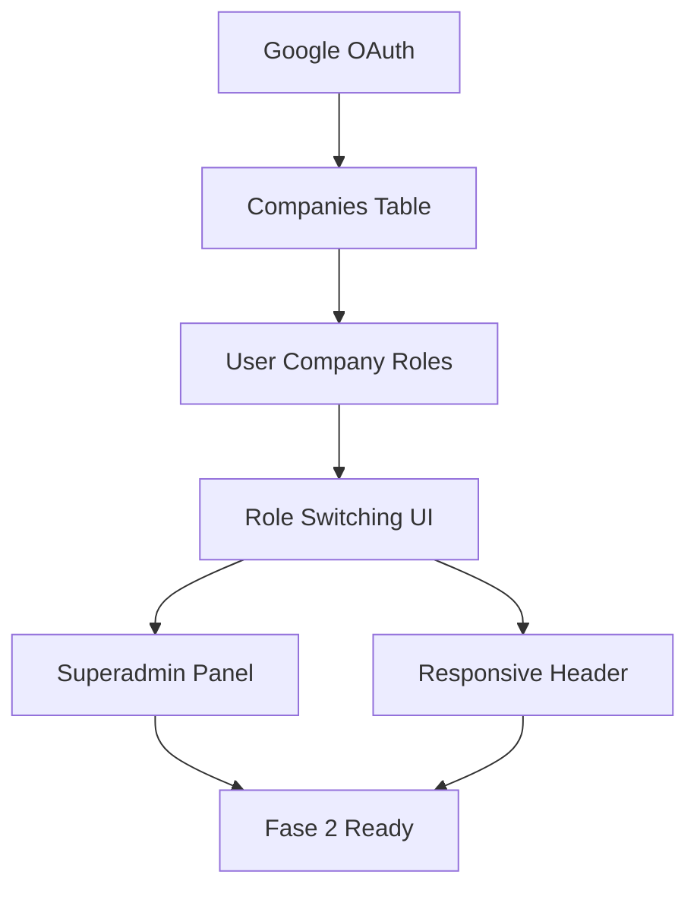

# FleetNest TMS - Task Breakdown Detallado

## 🔧 **FASE 1: FUNDACIÓN MULTI-TENANT**

### 1.1 Google OAuth Integration
**Dependencias:** Supabase Auth configurado ✅
**Complejidad:** Media | **Estimación:** 4-6 horas

#### Subtareas Técnicas:
1. **Configurar Google Cloud Console**
   - Crear proyecto en Google Cloud
   - Habilitar Google+ API
   - Configurar OAuth consent screen
   - Obtener Client ID y Client Secret

2. **Supabase OAuth Config**
   - Agregar Google como provider en Supabase
   - Configurar redirect URLs
   - Setear Site URL correctamente

3. **Frontend Implementation**
   - Instalar @supabase/auth-ui-react (opcional)
   - Crear botón "Sign in with Google"
   - Manejar OAuth callback
   - Error handling para OAuth flows

4. **Testing**
   - Probar login/logout con Google
   - Verificar user metadata
   - Validar session persistence

---

### 1.2 Companies Table & Multi-Tenancy
**Dependencias:** Ninguna
**Complejidad:** Alta | **Estimación:** 8-10 horas

#### Subtareas Técnicas:
1. **Database Migration - Companies**
   ```sql
   CREATE TABLE public.companies (
     id UUID PRIMARY KEY DEFAULT gen_random_uuid(),
     name TEXT NOT NULL,
     mc_number TEXT,
     dot_number TEXT,
     address JSONB,
     logo_url TEXT,
     settings JSONB DEFAULT '{}',
     is_active BOOLEAN DEFAULT true,
     created_at TIMESTAMPTZ DEFAULT now(),
     updated_at TIMESTAMPTZ DEFAULT now()
   );
   ```

2. **Database Migration - User Company Roles**
   ```sql
   CREATE TABLE public.user_company_roles (
     id UUID PRIMARY KEY DEFAULT gen_random_uuid(),
     user_id UUID REFERENCES auth.users(id) ON DELETE CASCADE,
     company_id UUID REFERENCES public.companies(id) ON DELETE CASCADE,
     role TEXT NOT NULL CHECK (role IN ('owner', 'senior_dispatcher', 'dispatcher', 'driver')),
     permissions JSONB DEFAULT '[]',
     delegated_by UUID REFERENCES auth.users(id),
     delegated_at TIMESTAMPTZ,
     is_active BOOLEAN DEFAULT true,
     created_at TIMESTAMPTZ DEFAULT now(),
     UNIQUE(user_id, company_id, role)
   );
   ```

3. **RLS Policies Implementation**
   - Policy para companies (solo usuarios con rol en esa company)
   - Policy para user_company_roles (solo sus propios roles)
   - Policy para service_role (acceso completo para sync)

4. **User Preferences Table**
   ```sql
   CREATE TABLE public.user_preferences (
     user_id UUID PRIMARY KEY REFERENCES auth.users(id) ON DELETE CASCADE,
     last_active_company UUID REFERENCES public.companies(id),
     last_active_role TEXT,
     settings JSONB DEFAULT '{}',
     updated_at TIMESTAMPTZ DEFAULT now()
   );
   ```

---

### 1.3 Role Switching UI System
**Dependencias:** Companies table, User roles
**Complejidad:** Alta | **Estimación:** 10-12 horas

#### Subtareas Técnicas:
1. **Custom Hooks Development**
   ```typescript
   // useAuth hook con multi-tenant
   const useAuth = () => {
     const [user, setUser] = useState<User | null>(null);
     const [activeCompany, setActiveCompany] = useState<string | null>(null);
     const [activeRole, setActiveRole] = useState<string | null>(null);
     const [availableCompanies, setAvailableCompanies] = useState<CompanyRole[]>([]);
   }

   // usePermissions hook
   const usePermissions = () => {
     const canAccess = (permission: string) => boolean;
     const hasRole = (role: string) => boolean;
   }
   ```

2. **Company Selector Component**
   - Dropdown con lista de compañías del usuario
   - Visual indicator de compañía activa
   - Cambio de contexto y recarga de datos
   - Loading states durante cambio

3. **Role Switcher Component**  
   - Dropdown con roles disponibles en compañía activa
   - Indicador visual de rol activo
   - Persistencia en localStorage
   - Validación de permisos en tiempo real

4. **Context Provider Setup**
   ```typescript
   const MultiTenantContext = createContext<{
     activeCompany: Company | null;
     activeRole: string | null;
     switchCompany: (companyId: string) => void;
     switchRole: (role: string) => void;
     permissions: string[];
   }>();
   ```

---

### 1.4 Panel Superadmin
**Dependencias:** Companies table, Role system
**Complejidad:** Media | **Estimación:** 6-8 horas

#### Subtareas Técnicas:
1. **Route Protection**
   ```typescript
   const SuperadminRoute = ({ children }) => {
     const { user } = useAuth();
     const isSuperadmin = user?.email === 'admin@fleetnest.com'; // Temporal
     return isSuperadmin ? children : <Navigate to="/" />;
   };
   ```

2. **Companies Management Page**
   - Lista de todas las compañías
   - Filtros (activas, suspendidas, por fecha)
   - Acciones: ver detalles, suspender, activar
   - Stats básicas por compañía

3. **Create Company Form**
   ```typescript
   interface CompanyForm {
     name: string;
     mcNumber?: string;
     dotNumber?: string;
     address: {
       street: string;
       city: string;
       state: string;
       zip: string;
     };
     ownerEmail: string; // Para crear primer usuario
   }
   ```

4. **Company Dashboard**
   - Overview stats (users, vehicles, loads)
   - Quick actions (suspend, contact owner)
   - Activity timeline básico

---

### 1.5 Responsive Header System
**Dependencias:** Role switching, Company selector
**Complejidad:** Media | **Estimación:** 6-8 horas

#### Subtareas Técnicas:
1. **Header Component Structure**
   ```typescript
   const Header = () => {
     const { isMobile } = useBreakpoint();
     return (
       <header className="flex items-center justify-between p-4">
         <div className="flex items-center gap-4">
           <SidebarTrigger />
           <Logo />
           {!isMobile && <CompanySelector />}
         </div>
         <div className="flex items-center gap-2">
           {!isMobile && <RoleSwitcher />}
           <ThemeToggle />
           <UserMenu />
         </div>
       </header>
     );
   };
   ```

2. **Mobile Adaptation**
   - Company/Role selector en sidebar en mobile
   - Hamburger menu para navegación
   - Touch-friendly button sizes
   - Responsive breakpoints

3. **Theme Toggle Implementation**
   ```typescript
   const ThemeToggle = () => {
     const [theme, setTheme] = useState<'light' | 'dark'>('light');
     
     useEffect(() => {
       document.documentElement.classList.toggle('dark', theme === 'dark');
     }, [theme]);
   };
   ```

4. **User Menu Dropdown**
   - Profile link
   - Company settings (si es owner)
   - Logout functionality
   - Role/company quick switcher

---

## 🔗 **Dependencias Entre Tareas**



---

## ⚠️ **Riesgos y Consideraciones**

### Riesgos Técnicos:
1. **OAuth Flow** - Configuración incorrecta puede bloquear logins
2. **RLS Policies** - Políticas mal configuradas = seguridad comprometida
3. **Role Switching** - State management complejo puede causar bugs
4. **Mobile UX** - Navegación en pantallas pequeñas puede ser confusa

### Mitigaciones:
1. **Testing exhaustivo** de flujos de auth
2. **Revisión de políticas** RLS antes de producción
3. **State management** con Context API bien estructurado
4. **Prototipado móvil** antes de implementación

---
*Última actualización: Enero 2025*